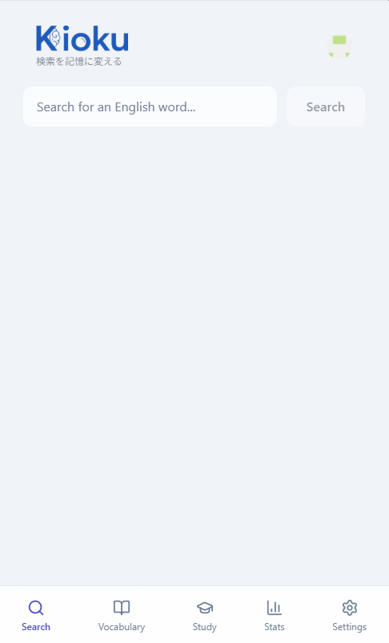
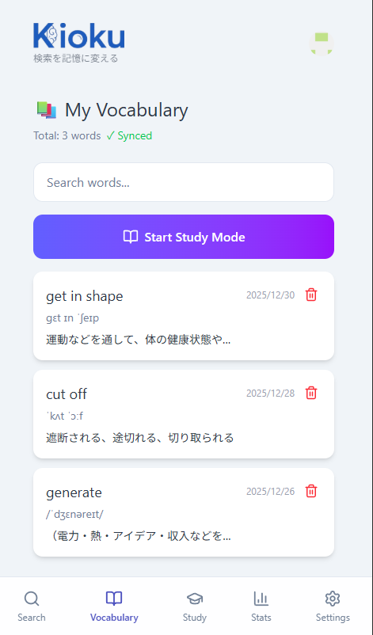
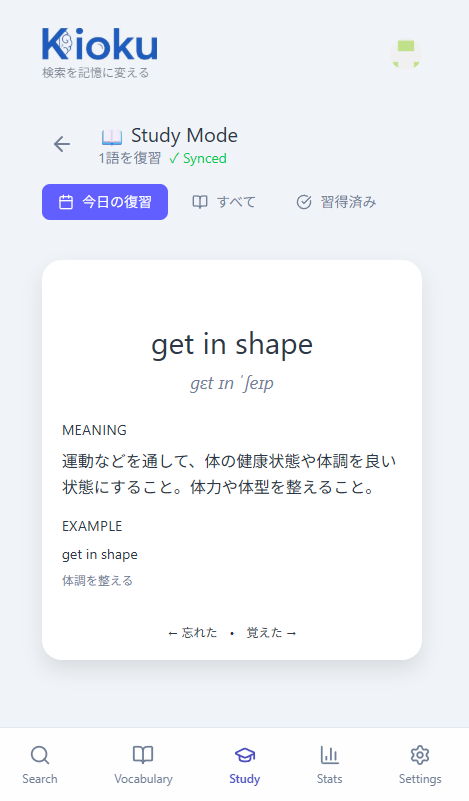
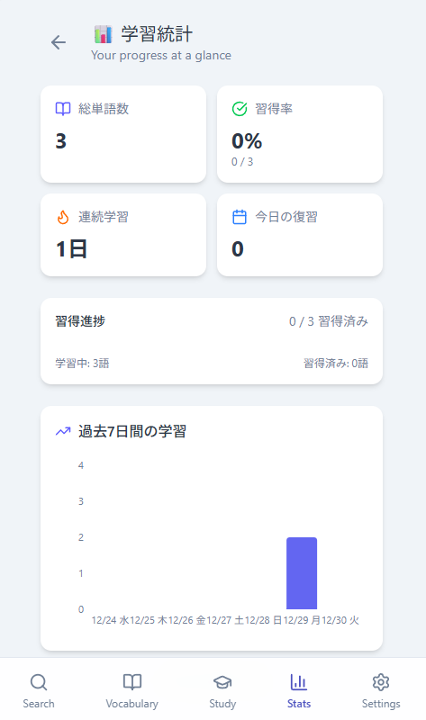

# Kioku

<div align="center">
  
  <p><strong>検索を記憶に変える英語学習アプリ</strong></p>
  <p>
    
    
    
    
  </p>
</div>

---

英語を調べるとき、その検索が一回きりで終わっていませんか？

**Kioku**は、調べた英語をSRS（間隔反復システム）で記憶に定着させるPWAアプリです。

## 💡 コンセプト

普段の「調べる」という行為に付加価値をつける。検索結果をワンスワイプで単語帳に追加し、科学的な復習間隔で効率よく記憶へ定着させます。

## ✨ 機能

<table>
  <tr>
    <td width="200" align="center">
      <br>
      <strong>AI検索</strong>
    </td>
    <td>
      <ul>
        <li>Gemini AI が英語を解析</li>
        <li>発音記号・意味・例文を自動生成</li>
        <li>文章入力時は全体翻訳 + 重要単語を抽出</li>
      </ul>
    </td>
  </tr>
  <tr>
    <td align="center">
      <br>
      <strong>単語帳</strong>
    </td>
    <td>
      <ul>
        <li>検索結果をスワイプで追加</li>
        <li>GitHub認証でデバイス間同期</li>
      </ul>
    </td>
  </tr>
  <tr>
    <td align="center">
      <br>
      <strong>SRS学習</strong>
    </td>
    <td>
      <ul>
        <li>SM-2アルゴリズムで最適な復習タイミングを計算</li>
        <li>復習間隔: 当日 → 1日 → 3日 → 7日 → 14日 → 30日</li>
        <li>フラッシュカードのスワイプUIで直感的に復習</li>
      </ul>
    </td>
  </tr>
  <tr>
    <td align="center">
      <br>
      <strong>学習統計</strong>
    </td>
    <td>
      <ul>
        <li>習得済み・学習中・新規単語の可視化</li>
        <li>学習進捗のグラフ表示</li>
      </ul>
    </td>
  </tr>
</table>

### その他

- **🔔 プッシュ通知**: 復習期限が来た単語があると通知（Vercel Cron）
- **🌙 ダークモード**: ライト/ダーク切り替え対応
- **📱 PWA**: ホーム画面に追加してネイティブアプリのように使用可能

## 🛠 技術スタック

| カテゴリ | 技術 |
|----------|------|
| フレームワーク | Next.js 16 (App Router, Server Components) |
| スタイリング | TailwindCSS 4 |
| データベース | Turso (libSQL) + Drizzle ORM |
| 認証 | NextAuth.js v5 (GitHub OAuth) |
| AI | Google Gemini API |
| アニメーション | Framer Motion |
| グラフ | Recharts |
| プッシュ通知 | Web Push API |
| レート制限 | Upstash Redis |
| デプロイ | Vercel |

## 📁 ディレクトリ構成

```
src/
├── app/           # Next.js App Router（各画面）
├── components/    # UIコンポーネント（Flashcard, Navigation等）
├── lib/           # ユーティリティ（LLMプロバイダー, SRSロジック）
├── db/            # Drizzle ORMスキーマ
├── actions/       # Server Actions
└── services/      # クライアントサービス
```

## 📝 ライセンス

MIT
